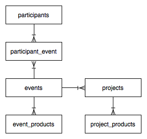

## NESCent hackathon data

This directory contains data collected over the course of the following hackathons:

- [NESCent Phyloinformatics Hackathon: Lowering the Barrier](01_phylohack_metadata),
  December 11-16, 2006, Durham, NC
- [NESCent Hackathon on Comparative Methods in R](02_comparativer_metadata), December 
  10-15, 2007, Durham, NC
- [Evolutionary Database Interoperability Hackathon](03_dbinterop_metadata), March 9-14, 
  2009, Durham, NC
- [Phyloinformatics VoCamp](04_vocamp_metadata), November 7-12, 2009, Montpellier, 
  France
- [GMOD Tools for Evolutionary Biology](05_gmodtools_metadata), November 8-13, 2010, 
  Durham, NC
- [Phylotastic: the Tree of Life, as you need it](06_phylotastic1_metadata), June 4-9, 
  2012, Durham, NC
- [Phylotastic 2](07_phylotastic2_metadata), January 28-February 2, 2013, Tucson, AZ
- [Tree-for-all Hackathon](08_treeforall_metadata), September 15-20, 2014, Ann Arbor, 
  MI
- [Population Genetics in R Hackathon](09_rpopgen_metadata), March 16-21, 2015, Durham, 
  NC
  
### Data tables

For these hackathons, we have collected data in tabular (tab-separated) form, which we 
have normalized as a small relational database. For each table we also provide a metadata
file to explain what the columns mean, and between some tables we have intersection tables
to model many:many relationships. These are the tables:

- [events](events.tsv), with [metadata](events_meta.tsv)
- [participants](participants.tsv), with [metadata](participants_meta.tsv)
- [participant_event](participant_event.tsv), i.e. which participants attended which 
  events, with [metadata](participant_event_meta.tsv)
- [projects](projects.tsv), with [metadata](projects_meta.tsv)
- [project_products](project_products.tsv), i.e. products that derive from projects, with
  [metadata](project_products_meta.tsv)
- [event_products](event_products.tsv), i.e. products that derive directly from events,
  with [metadata](event_products_meta.tsv)
  

_Entity-Relationship Diagram (ERD) of the relationships between the tables visualized 
in simplified form using crow's feet notation._
